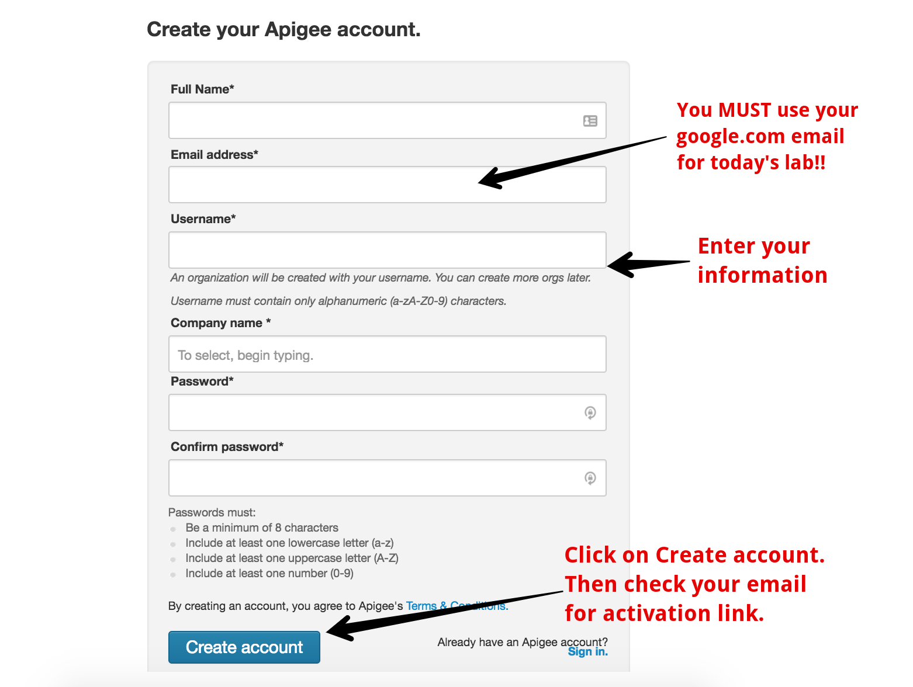
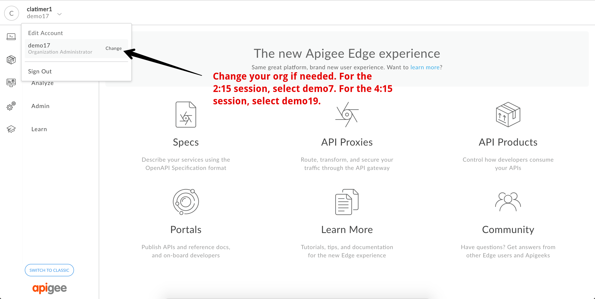

# Mini DevJam

Welcome to the Apigee mini hands on DevJam workshop.

# Getting Started

  In this workshop, you will get first hand exposure to Apigee Edge, the full featured enterprise API Management platform. To get started with Apigee Edge, you will need to get access to an Apigee instance. 

  If you're new to Apigee, visit this page to create an account: <a href="https://apigee.com/edge" target="_blank">https://apigee.com/edge</a>

  You will be presented with a sign in form as shown here:

  

  Select the _Create Account_ option. This will direct you to this registration form:

   

  Fill in your information and select _Create account_ to submit your registration information. In a few minutes you will receive an email from Apigee with an email verification link:

  

  Once your account has been created, you need to be added to the Apigee environment we'll be using today. To get added, go to:

## go/AddMeToOrg?id=email@google.com

  replacing `email@google.com` with your google email address. This link should add you to the Apigee Edge instance we'll be using today and redirect you to the Apigee Edge UI:

  

  Once you are successfully in the Apigee Edge UI, make sure you are in the correct Apigee organization. For the 2:15pm session, you should be in demo7. For the 4:15 session you should be in demo19.

  

  You are now ready to get started on the labs.

# Hands on Labs

1. [Adding a new API Specification](lab1.md)
2. [Traffic Management and Basic Security](lab2.md)
3. [API Publishing and Consumption](lab3.md)

# Appendix

If you get done with all the standard labs and want to keep going, try out these additional hands-on exercises:

1. [Custom Reporting](lab_appendix1.md)
2. [Caching](lab_appendix2.md)