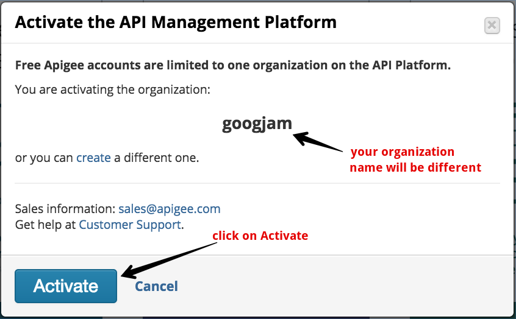

# Mini DevJam

Welcome to the Apigee mini hands on DevJam workshop.

# Getting Started

  In this workshop, you will get first hand exposure to Apigee Edge, the industry's leading API Management platform. To get started with Apigee Edge, you will need to create an account and set up a free trial instance of Apigee Edge that you can use to build our labs today.

  If you already have a trial account with Apigee, you can skip the following registration steps and use your existing instance. Access your Apigee instance by signing in here: <a href="https://apigee.com/edge" target="_blank">https://apigee.com/edge</a>.

   If you're new to Apigee, visit this page to create an account: <a href="https://apigee.com/edge" target="_blank">https://apigee.com/edge</a>

  You will be presented with a sign in form as shown here:

  

  Select the _Create Account_ option. This will direct you to this registration form:

   

  Fill in your information and select _Create account_ to submit your registration information. In a few minutes you will receive an email from Apigee with an email verification link:

  Click on the _Activate your account_ link to be redirected to the Apigee sign in form. After signing in you will be presented with a number of options. 

   

  Select the _ACTIVATE_ link under _Create and Manage APIs_. This will launch a dialog which lets you activate your organization:

  

  Click on the _Activate_ button to begin the initialization process. If your organization does not activate after 2-3 minutes, refresh the page. Once the organization has been activated, you should see an option to launch Apigee Edge.

  

  Select the *Launch* button under the *Create and Manage APIs* to access the Apigee Edge Management UI. This *SHOULD* take you to the Dashboard of the Apigee Edge Management UI which looks like this:

  

  Once you have successfully created an account and accessed the Apigee Edge Dashboard, you are ready to start on the labs. 

# Hands on Labs

1. [Adding a new API Specification](lab1.md)
2. [Traffic Management and Basic Security](lab2.md)
3. [API Publishing and Consumption](lab3.md)

