# Lab 2 - Traffic Management and Basic Security

This lab builds upon the work we did in [lab 1](lab1.md). In this lab, we will take the pass-through API Proxy that we created in lab 1 and add two new capabilities: a Spike Arrest to throttle traffic and an API Key validation for a very basic layer of security.

Start by opening up the API Proxy editor by clicking on the develop tab:

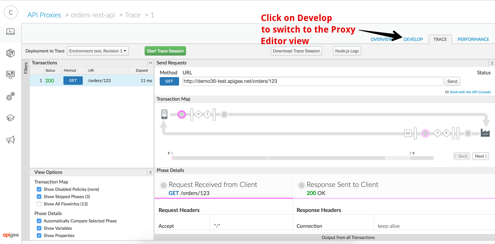

Once in the API Proxy editor, you can click on the *+Step* button in the top right to add a new policy to your API Proxy:

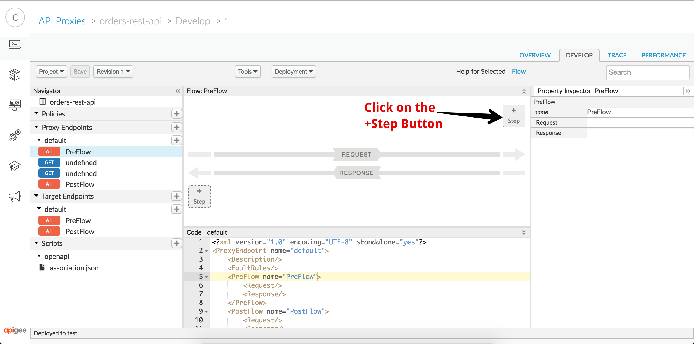

This will launch a dialog box that you can use to add a number of policies to your API Proxy. In this case, you're going to select the Spike Arrest policy from the list and click on *Add* to attach the poicy to the request pipeline of your API Proxy:

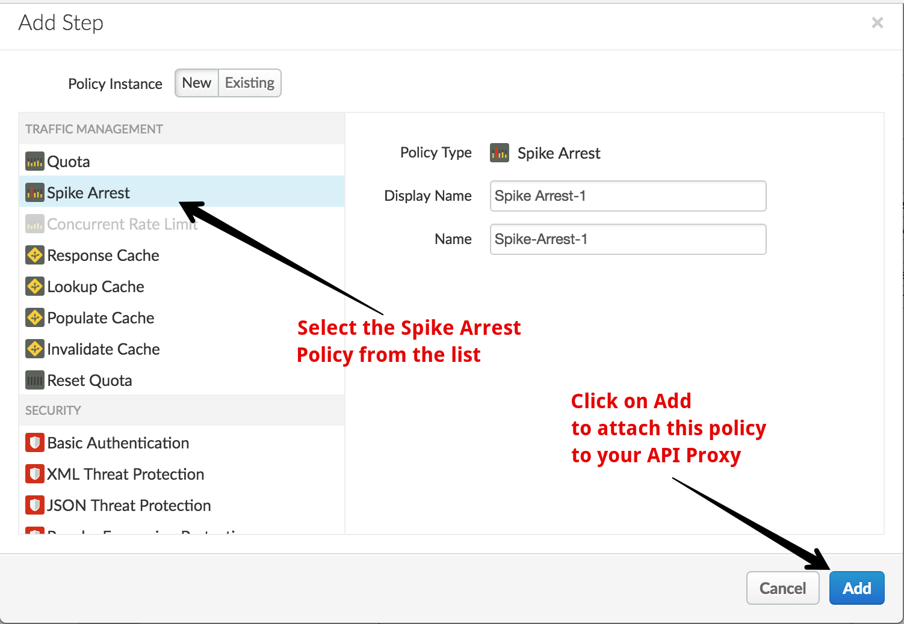

By default the Spike Arrest policy is configured to throttle traffic when incoming API calls exceed a frequency of 30 calls per second. Because this is difficult for us to test, we'll modify the XML configuration for the policy to set the rate to 5 per minute:

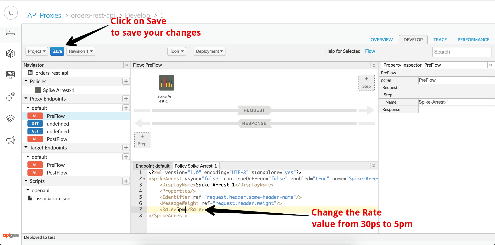

Once you have made the modification, click on the blue Save button to save and deploy your changes. Once you see the confirmation that your API Proxy was saved successfully, click on the trace tab so we can test the Spike Arrest:

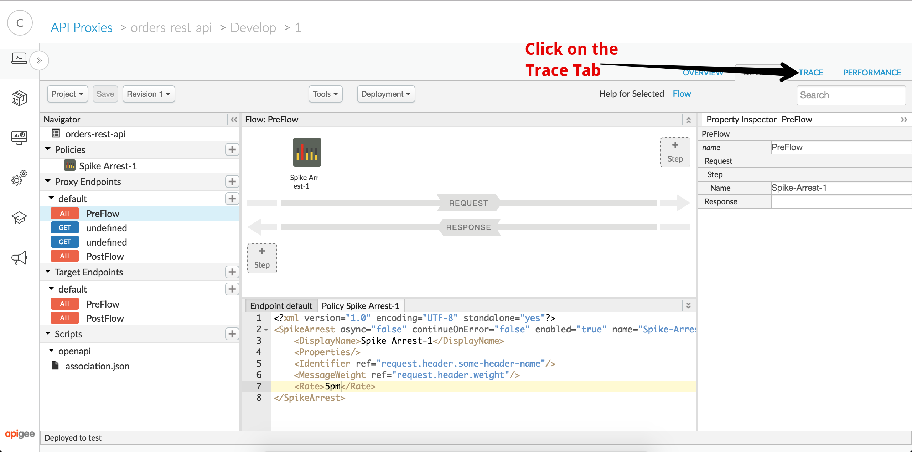

Just as in lab 1, start a new trace session by clicking on the *Start Trace Session* button. You can then start sending in a series of API calls to trigger the Spike Arrest:

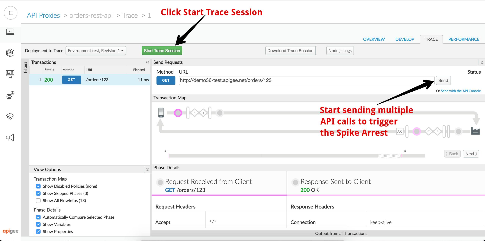

After a few calls you should be able to observe that the API proxy starts to throttle your API calls:

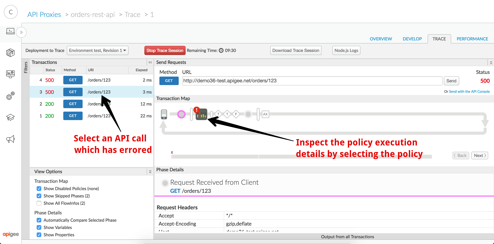

Note: One common question that gets asked is why the platform throttles traffic before you make 5 API calls. After all, you configured your Spike Arrest to allow 5 calls per minute, not 3! The answer is that Spike Arrest is used to shape traffic and start throttling based on the *frequency* of API calls, not the total number. To illustrate why, imagine that you had configured your Spike Arrest to limit traffic to 1,000 calls per minute. If you received all 1,000 calls in the first second, your backend may still choke on the sudden spike. Instead, Spike arrest will detect when calls start to exceed the configured frequency. In our case, a Spike Arrest with a rate of 5 per minute will start to throttle calls if more than 1 every 12 seconds are received. For a specific allowable number of calls, you can use alternate policies such as Quota to allow a certain number of calls per second, minute, hour, etc regardless of how quickly they are made. 

Once you've verified that the Spike Arrest is working correctly, switch back to the Develop tab to go back to the API Proxy editor. Once in the API Proxy Editor view, once again click on the top right *+Step* button:

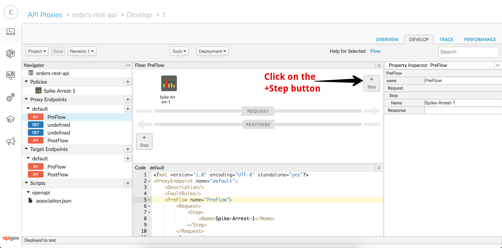

Scroll down to find the Verify API Key policy in the list, select it, then click on Add:

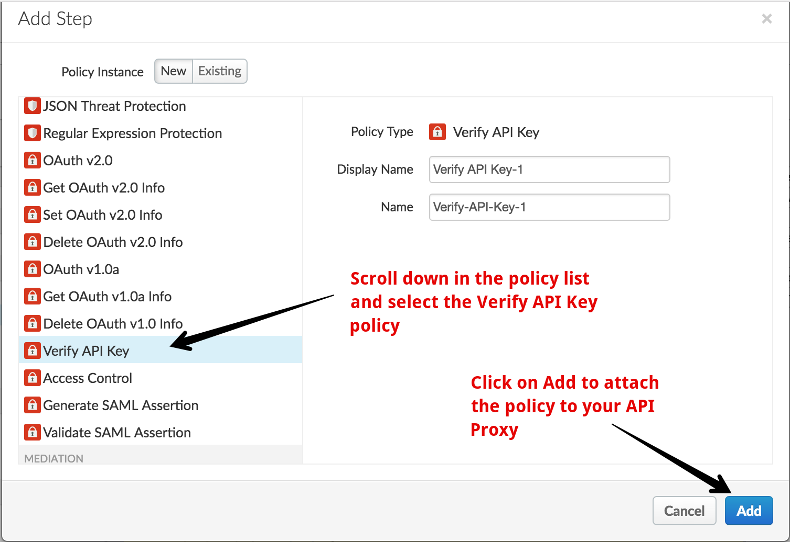

Once the policy is added, drag it to the left of the Spike Arrest and then click on the blue Save button:

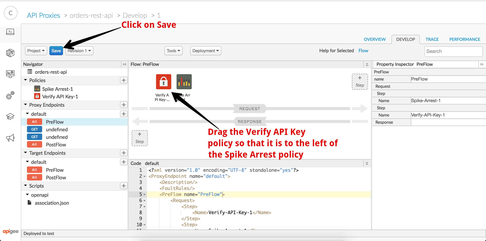

Once you see the confirmation that your API Proxy was saved successfully, click on the trace tab so we can test the API Key Validation policy:

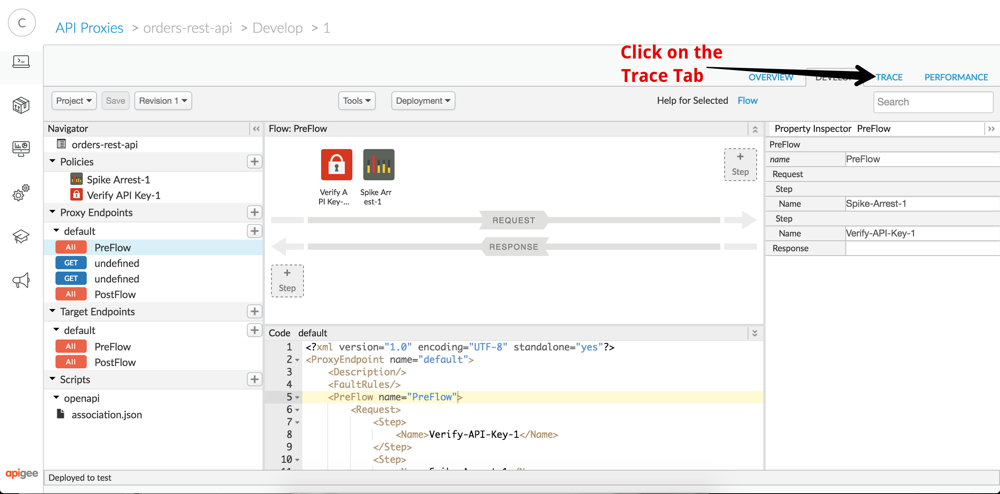

Just as before, click on the *Start Trace Session* button to start a trace session. Make another API call and verify that you get a 401 response indicating that the call is unauthorized. You can select your API call in the list on the left to verify that the API Key Validation policy rejected the API call due to a missing API key.

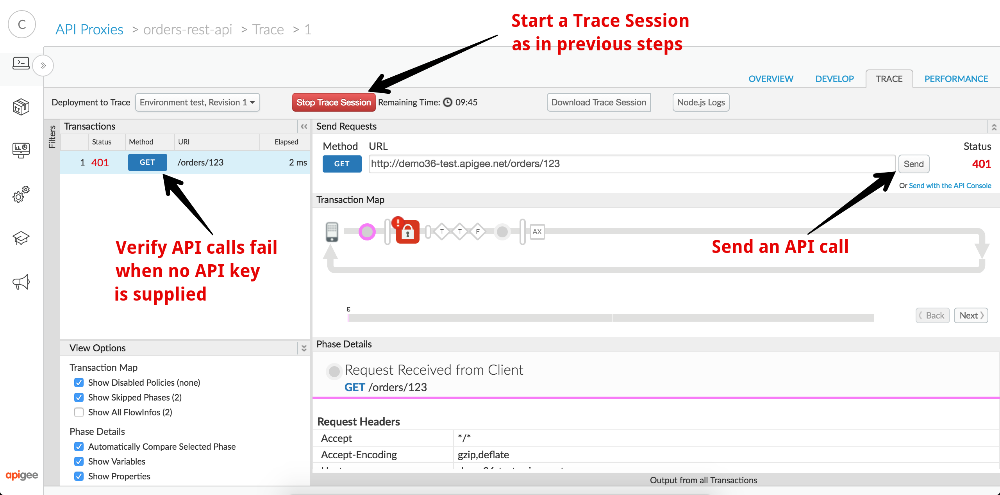

# Up Next

Now that you've applied the Verify API Key policy to your API, we need to look at how you can grant access to your API. In the next lab, we'll show how you publish your API, configure a new application, and give that application access to your API. 

When you're ready, you can get started on [Lab 3 - API Publishing and Consumption](lab3.md).
