# Lab 3: API Publishing and Consumption

This lab builds on the work you did in [lab 1](lab1.md) and [lab 2](lab2.md). In this lab, we will look at how you can grant access to the API you secured in lab 2 by using the Verify API Key policy.

To start, open the Publish menu in the left sidebar:

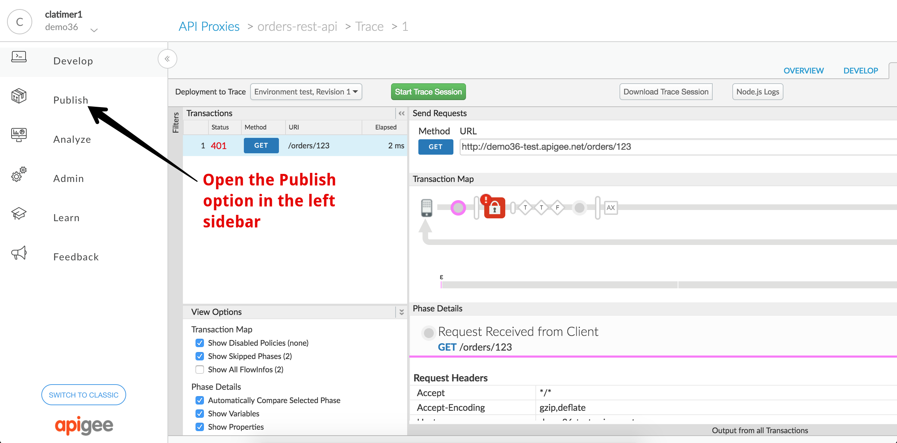

Once that expands, select the API Products option:

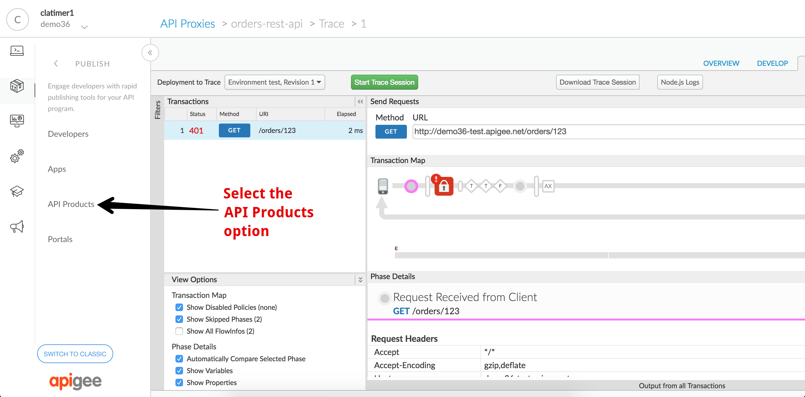

This will take you to the API Products page. If you have API Products already configured in your organization you will see a list of them here. Otherwise, you may see a page encouraging you to set one up. API Products are the mechanism within Apigee Edge that allow you to bundle APIs so that developers can consume them. To see how this works, start by selecting the *+API Product* button:

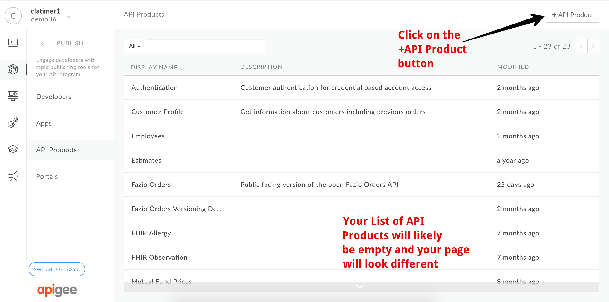

This will navigate you to a form where you can input information about your API Product. Start by specifying the Product Details as shown in the following screen capture:

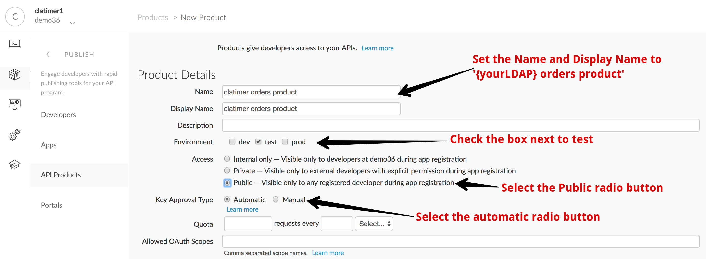

Then scroll down to the Resources section and fill that out as shown:

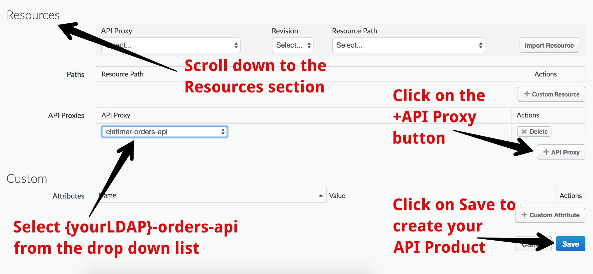

Click on the Save button to save your API Product. Once saved, it will appear in the list of API Products:

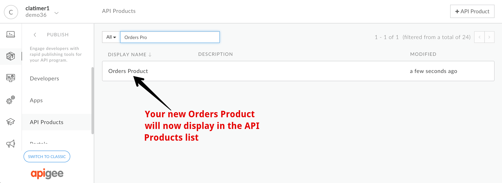

You now have an API Product created, but no developers or applications who can use the product. To create a new developer, we'll navigate to the Developer management view by clicking on the *Developers* option in the left side nav bar:

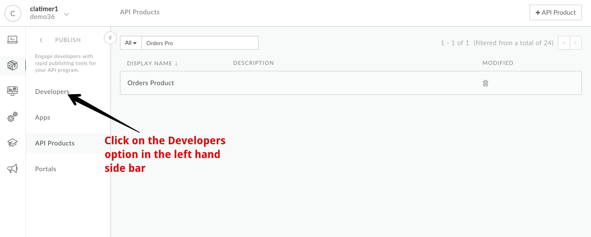

This will take you to the developer management page. Click on the *+Developer* button to create a new developer:

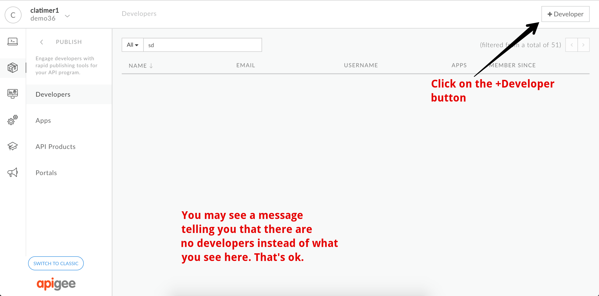

When the new developer dialog appears, enter in your information to add yourself as a developer:

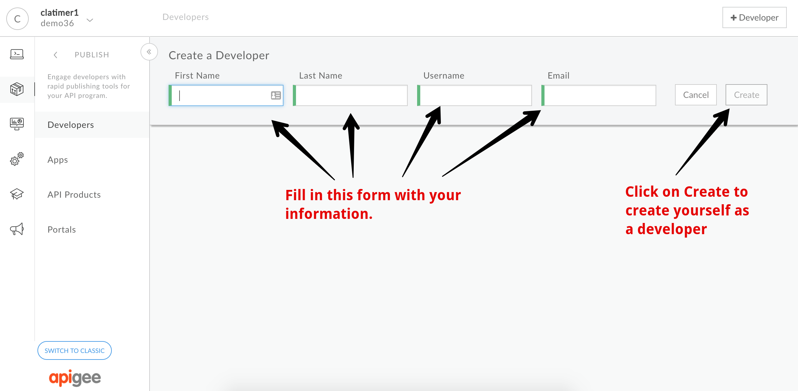

After you save, you'll see yourself listed as a developer in your organization. In Apigee, API Keys are not assigned to a specific developer, but to a particular application which belongs to a specific developer. To obtain an API Key, we'll now need to create an application. Start by selecting the Apps option in the left side nav bar. 

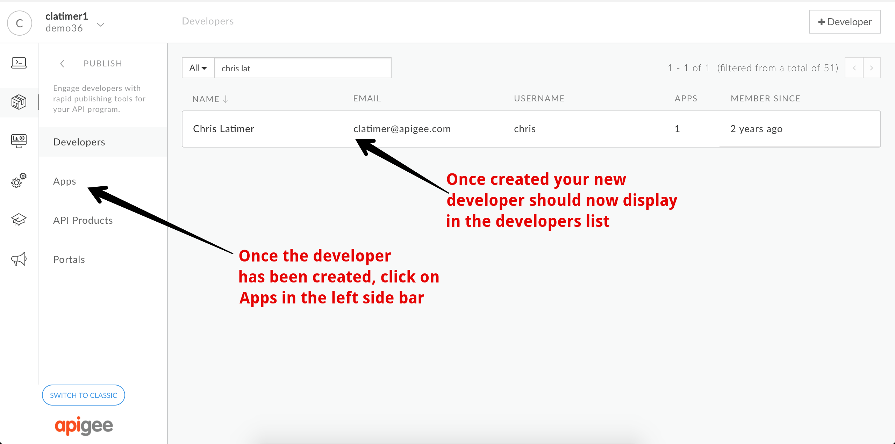

This will navigate you to the App management page. Create a new application by selecting the *+App* button:

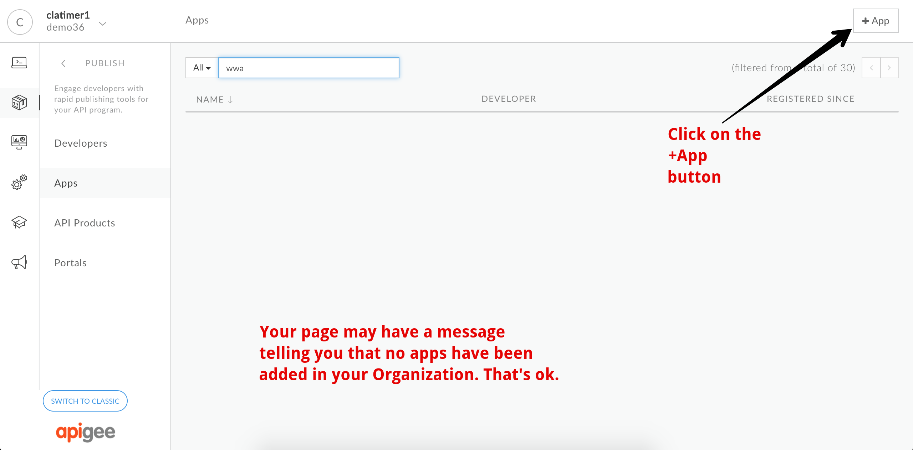

This will reveal a form that you can use to create a new application. The form you see will look slightly different than what is shown here. That is because the screen capture shown below is from an Apigee instance which has monetization configured. Enter the details for your application, noting that you will not have the radio button option for developer and company. Simply find the developer you configured in the previous step and assign that developer as the owner of the new app:

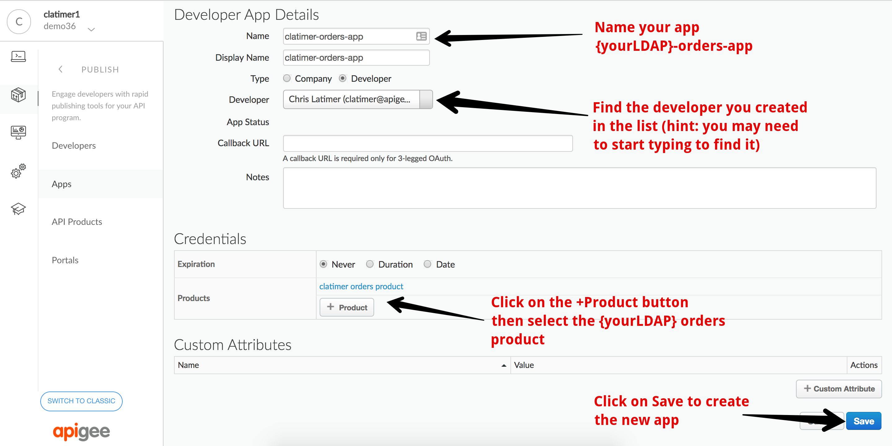

Enter the fields as shown above and click on Save. Once saved, the new application will be shown in the apps list. Click on your application so that we can see its details and retrieve its API Key:

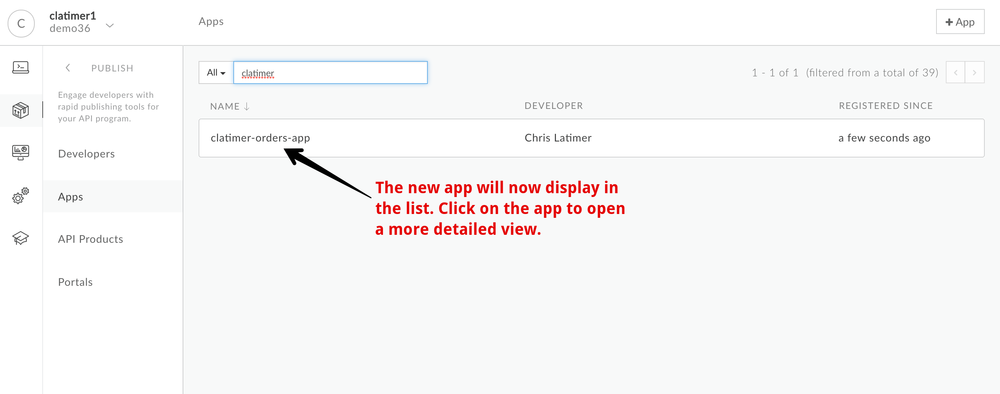

Once in the details view, click on the *Show* button in the Consumer Key field to reveal the API key for your new app:

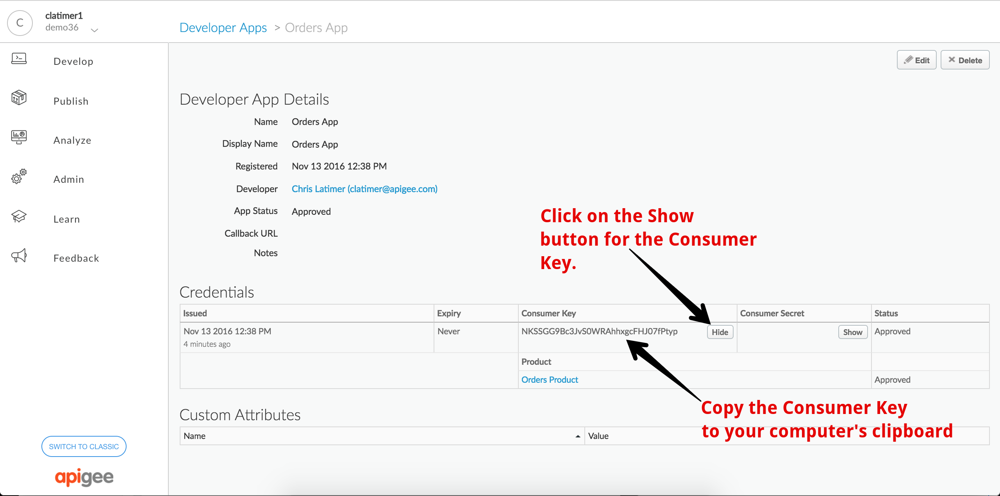

Copy the API key to your computer's clipboard (You might want to save it off to a scratchpad somewhere for later reference just in case you copy something else to your clipboard).

